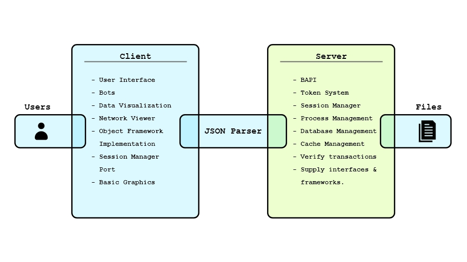

***"An over-engineered masterpiece."***

Joker is a prototype build for an upcoming web application **Bi**. Written completely in C++, Joker currently presents itself as an experimenting field for its developer who are still brainstorming on the initial feature set of Bi.

## What is Bi?
Technically a superset of Joker. Once developed **Bi** will be a ready to deploy piece of software than would enable any interested organization to enable 'one click' bicycle issuing and deposit facility within their campus. Bi will be a fully automated system providing an interface so simple that anyone without any technical intimacy will be able to use it. Bi seperates itself from other existing Bicycle rental or similar solutions by the wide array of features it provides. To name a few:
  - Extremely low cost of installation and future maintenance.
  - State-of-the-art Anti-Theft mechanism.
  - Beautiful usage metrics for every user.
  - No human intervention is needed in any stage of the operation except maintenance and other one-time installation requirements.
 
## How Joker is structured?
Although Joker is implemented in C++, it tries to mimic a full-stack web-application that are generally made using languages other than C++. Joker is structured in 3 primary components:
- **Client** - Contains the basic interface implementations, modest visual FX files and bots.
- **JSON** - The communication channel between Client and Server side of Joker.
- **Server** - Contains the API headers, token system, session manager, process management and data handler.

## Components Index
To read in detail about all the involved components included in this project. Kindly refer to the following list.

**Disclaimer**: *Joker is still in active development thus some links given above might not work or would still have incomplete documentation that'll will be updated as soon as the development reaches appropriate stage.*
- [BAPI](include/readme.md)
- [Bots]()
- [Client]()
- [Data Caching]()
- [Data Classification]()
- [Data Indexing]()
- [Data Storage Types]()
- [Data Strcutures]()
- [Dummy Data]()
- [Graphics and other visuals]()
- [Interfaces and frameworks]()
- [JSON System]()
- [Layered processing]()
- [Process Manager]()
- [Server]()
- [Session Manager]()
- [Token System]()

## Dependencies
Requires C++17 or higher in the running environment. That's it.

## How to run Joker?
It is uploaded as a Visual Studio project and the project file is included in the main directory.

## What Joker is currently capable of?
Embarrasing to admit, it just does *nothing useful* as of now. The Client and Server components of this projects are far from complete and can be basically referred to as stubs. Currently the development is focused at creating the sub-components and setting up connections between them. For more nuanced information about the development refer to the commit history or read the Development section

### Development
- **Basic Graphics**
- **BAPI Headers**
- **Token System**
- **Basic Login System**
- **Data Storage Classification**
- **BAPI Connectivity**
- **Dummy Data**
- **JSON** --- (Currently here)

##### TO-DOs
 - Complete Dummy data installation.
 - Test JSON parser
 - Construct interfaces for Client objects
 - Update Session manager and Login System.
 - Implement Issue and Deposit system for single user.
 - Add realtime data updation.
 - ... *(this is a rabbit hole. The To-Do list will be updated later from here as deemed necessary.)*
 - Add custom STL library
 - Remove unnecessary Graphics
 - Transfer database from text files to a DBMS system.
 - Complete this documentation.
 - Elaborate more on how **Joker** is much more than just a weird C++ project
##### Road Map
- Add Incentive distribution system
- Support / Moderators and Messaging system
- Implement training data procurement system
- Improve automated Bots
- Improve Network Viewer
- Add Self-Scaling ability

---

   ***This documentation is made with the help of Dillinger.io***
